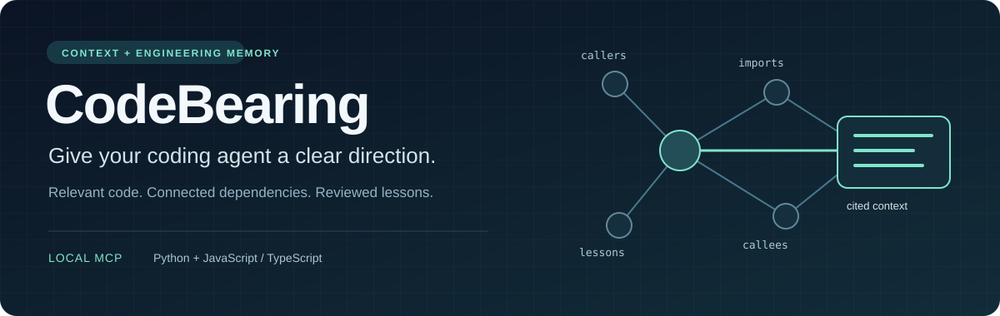
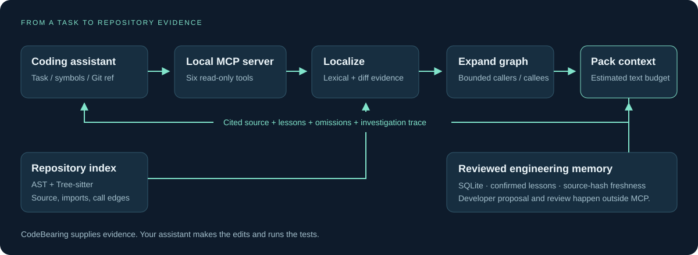

<p align="center">
  
</p>

<p align="center">
  <strong>Change-aware context and engineering memory for AI coding assistants.</strong><br>
  Local MCP infrastructure for Claude Code, Cursor and Codex.
</p>

<p align="center">
  <a href="docs/RELEASING.md"></a>
  <a href="pyproject.toml"></a>
  <a href="#six-tools-one-local-server"></a>
  <a href="docs/LANGUAGES.md"></a>
</p>

<p align="center">
  <a href="#get-started">Get started</a> ·
  <a href="#how-it-works">Architecture</a> ·
  <a href="#see-the-context">Example output</a> ·
  <a href="#engineering-memory">Memory</a> ·
  <a href="#built-to-be-inspected">Evaluations</a>
</p>

## The right function is only the beginning

A change rarely stops at one function. Its callers, imports, shared helpers and
previously corrected mistakes can matter just as much.

CodeBearing helps your assistant follow those connections. Give it a task,
indexed symbol or Git revision; it returns **cited source, dependency evidence
and relevant confirmed lessons**, packed into an explicit estimated text budget.
It also shows what was omitted and why the investigation stopped.

**Your assistant edits and tests. CodeBearing supplies the evidence.**

## Get started

Install once with [uv](https://docs.astral.sh/uv/getting-started/installation/)
and Git:

```shell
uv tool install --python 3.11 "codebearing[mcp,typescript] @ git+https://github.com/Agamjot27/CodeBearing.git"
```

From the project you want to work on, choose your assistant:

| Assistant | Connect this project |
| --- | --- |
| Claude Code | `codebearing setup --client claude` |
| Cursor | `codebearing setup --client cursor` |
| Codex | `codebearing setup --client codex` |

Setup preserves other MCP entries and checks the six-tool transport. Open or
restart your assistant in the project, then enable or approve the server when
prompted. Your assistant starts it automatically.

Try this prompt:

> Use CodeBearing to investigate this bug before editing. Show the relevant
> functions, dependencies, confirmed lessons and any gaps. Then make the fix
> and run the tests.

**Runs locally. No separate model API key.** Your assistant uses its own account.
The command includes optional JavaScript/TypeScript indexing. Version 0.9.0 is
installed from Git; it is not published to PyPI.

[Full quickstart](docs/QUICKSTART.md) · [Setup and troubleshooting](docs/MCP.md) ·
[Try the public demo](docs/DEMO.md)

## How it works



| Stage | What happens | Implementation |
| --- | --- | --- |
| **Index** | Capture source and extract symbols, imports and static relationships. | [index.py](diffcontext/index.py), [typescript.py](diffcontext/typescript.py) |
| **Localize** | Rank task evidence or map tracked Git changes, including deleted code. | [retrieval.py](diffcontext/retrieval.py), [changes.py](diffcontext/changes.py) |
| **Expand** | Follow callers and callees within explicit bounds. | [index.py](diffcontext/index.py), [investigation.py](diffcontext/investigation.py) |
| **Recall** | Retrieve confirmed lessons whose source evidence is still fresh. | [memory.py](diffcontext/memory.py), [service.py](diffcontext/service.py) |
| **Compile** | Pack complete excerpts, imports and recognized local Python exceptions; disclose gaps. | [context.py](diffcontext/context.py) |

Python uses the standard-library AST; optional JS/TS adapters use Tree-sitter.
SQLite stores local memory and optional indexing cache. Context preparation needs
no LLM call or hosted service.

## See the context

In the [public refund fixture](evals/coding_tasks/refund-rounding/repo), rounding
once after summing produces a different total from rounding each invoice line.
Selecting `refunds.py:refund_total` also surfaces its rounding helper, caller and
related invoice calculation.

**Actual compiled source, excerpted for readability:**

```text
--- refunds.py:5-6 | refund_total ---
Reason: requested seed; called by service.py:refund_preview; calls invoice.py:round_line
Module imports:
from decimal import Decimal
from invoice import round_line
Source:
def refund_total(amounts):
    return round_line(sum((Decimal(str(amount)) for amount in amounts), Decimal("0")))

--- invoice.py:4-5 | round_line ---
Reason: called by refunds.py:refund_total
Module imports:
from decimal import Decimal, ROUND_HALF_UP
Source:
def round_line(amount):
    return Decimal(str(amount)).quantize(Decimal("0.01"), rounding=ROUND_HALF_UP)
```

The full captured result includes **five symbols, 514 estimated text tokens under
a 2,000-token allowance**, and a static-analysis warning. It has no confirmed
lessons or omitted symbols. These counts describe this fixture, not a performance
or savings benchmark.

The response also carries inclusion reasons, source hashes, omissions and missing
seeds. `investigate` adds the stop reason and trace; `detail="full"` requests full
diagnostics on a fresh run. The text budget excludes JSON metadata and your
assistant's own instructions.

[Reproduce this output](docs/README_EXAMPLE.md) · [Walk through the repair](docs/DEMO.md)

## Six tools, one local server

| MCP tool | What your assistant can ask |
| --- | --- |
| `search_symbols` | Where are the functions relevant to this task? |
| `localize_changes` | Which indexed symbols changed relative to this Git revision? |
| `analyze_impact` | What calls these symbols, and what do they call? |
| `compile_context` | Package selected evidence under this estimated text budget. |
| `get_lessons` | What confirmed, fresh advice applies to these symbols? |
| `investigate` | Gather context through a bounded loop and explain its stopping point. |

All six tools are read-only and bound to the configured repository. They do not
edit source, run tests or confirm lessons.

## Engineering memory

Corrections can become reusable evidence through an explicit review workflow:

**Propose a lesson → developer confirms → retrieve in future requests →
exclude when source changes.**

| State | Retrieval behavior |
| --- | --- |
| Proposed | Kept for review; excluded from context. |
| Confirmed and fresh | Eligible when relevant to the selected symbols. |
| Stale, disputed or superseded | Excluded from injected advice. |

Lessons live in repository-local SQLite. Source-hash checks prevent advice based
on changed or deleted evidence from being silently reused. Proposal and
confirmation are manual; the MCP server does not automatically learn from chats.

[Memory continuity walkthrough](docs/demos/MEMORY_CONTINUITY.md) ·
[Memory implementation](diffcontext/memory.py)

## Built to be inspected

The project includes regression tests, authored coding tasks, frozen-request
model trials and inspectable investigation traces.

| Evidence | What you can inspect |
| --- | --- |
| **188 passing tests** | Latest recorded 0.9.0 integrated suite; indexing, retrieval, budgets, memory, MCP and harness behavior. |
| **32 repeated model trials** | Four authored tasks × two context policies × two requested smaller models × two repetitions. Frozen inputs, grader fingerprints, checkpoints and observed token usage. |
| **Failure → compiler fix** | A retrieved function was missing its exception declaration. The compiler now bundles recognized local exceptions; eight separate same-task repair checks passed. |
| **Fresh-process memory demo** | Proposal exclusion, explicit review, persisted retrieval and stale exclusion. |
| **Clean-wheel validation** | Installed CLI, setup, six-tool stdio discovery and cache reuse outside the source checkout. |

[Trial results and methodology](docs/demos/SMALL_MODEL_PACKET_TRIALS.md) ·
[Exception repair record](docs/work-items/WI-028-python-exception-evidence/BUG.md) ·
[Release verification](docs/work-items/WI-029-codebearing-090-release/FEATURE.md)

<details>
<summary><strong>Scope and evaluation notes</strong></summary>

Static analysis can miss dynamic dispatch, runtime configuration, general globals
and type-driven relationships. JS/TS support does not imply every framework or
module system is resolved; see [language support](docs/LANGUAGES.md).

The 32-call study uses authored exact-symbol tasks, not an end-to-end comparison
with normal assistant workflows. Its original results are retained, including
failures. The later exception checks are development verification on the same
task. Memory demonstrates storage and filtering, not measured later model gains.
Whole-file source hashes can conservatively invalidate otherwise useful lessons.

Estimated text tokens are not whole-session billing tokens. Neither the text
budget nor the test suite establishes general quality, speed or cost improvement.

</details>

## Explore further

| Use it | Understand it | Develop it |
| --- | --- | --- |
| [Quickstart](docs/QUICKSTART.md) | [Execution flows](FLOW.md) | [Development commands](docs/DEVELOPMENT.md) |
| [First bug-fix task](docs/FIRST_TASK.md) | [Engineering decisions](DECISIONS.md) | [Coding evaluations](docs/CODING_EVALS.md) |
| [MCP troubleshooting](docs/MCP.md) | [Retrieval design](docs/RETRIEVAL.md) | [Release process](docs/RELEASING.md) |
| [Language support](docs/LANGUAGES.md) | [Incremental indexing](docs/INDEXING.md) | [Current handover](HANDOVER.md) |

Found a localization miss, incomplete dependency path or confusing setup step?
[Open an issue](https://github.com/Agamjot27/CodeBearing/issues) with a minimal
reproduction and the relevant warnings or omissions.
